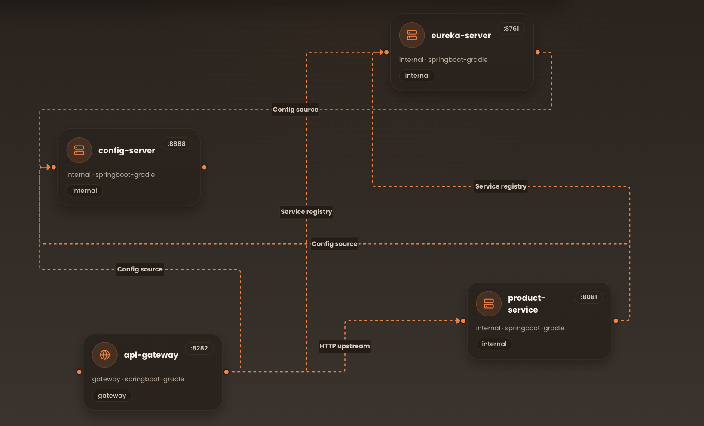

# Spring Microservices Deployment Starter

This workspace is prepared as a Spring Cloud microservice stack with the services you asked for:

- `config-server`
- `eureka-server`
- `product-service`
- `api-gateway`



### Dependencies

- **config-server** depends on: *none*
- **eureka-server** depends on: ["config-server"]
- **product-service** depends on: ["config-server", "eureka-server"]
- **api-gateway** depends on: ["config-server", "eureka-server", "product-service"]

## Architecture

- `config-server` serves centralized configuration from a bundled native repository.
- `eureka-server` provides service discovery.
- `product-service` registers itself in Eureka and reads shared configuration from the config server.
- `api-gateway` routes traffic to `product-service` through Eureka using `lb://product-service`.

## Ports

- `8888` config server
- `8761` Eureka dashboard
- `8081` product service
- `8282` API gateway
- `5434` PostgreSQL mapped from the container's `5432`

## Run Locally With Docker Compose

```bash
docker compose up --build
```

Useful URLs after startup:

- Config Server: `http://localhost:8888`
- Eureka Dashboard: `http://localhost:8761`
- Product API through Gateway: `http://localhost:8282/api/v1/products`
- Swagger through Gateway: `http://localhost:8282/swagger-ui/index.html`

## Deployment Notes

For a deployment platform, create one service per app and pass these environment variables where needed:

- `CONFIG_SERVER_URL`
- `EUREKA_SERVER_URL`
- `SERVER_PORT`
- `SPRING_DATASOURCE_URL`
- `SPRING_DATASOURCE_USERNAME`
- `SPRING_DATASOURCE_PASSWORD`
- `SPRING_DATASOURCE_DRIVER_CLASS_NAME`

Recommended startup order:

1. `config-server`
2. `eureka-server`
3. `postgres`
4. `product-service`
5. `api-gateway`

## Config Repository

The centralized configuration files live in:

- `config-server/src/main/resources/configurations/application.yaml`
- `config-server/src/main/resources/configurations/eureka-server.yaml`
- `config-server/src/main/resources/configurations/product-service.yaml`
- `config-server/src/main/resources/configurations/api-gateway.yaml`
